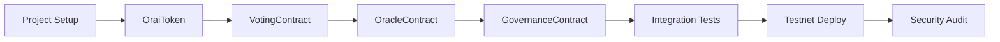

# Development Roadmap - Orai Smart Contracts

## Week 1: Foundation
**Goal**: Set up project and implement token contract

### Monday-Tuesday
- [ ] Initialize Hardhat project
- [ ] Configure for 0G testnet
- [ ] Set up development environment

### Wednesday-Friday
- [ ] Implement OraiToken.sol
- [ ] Write token tests
- [ ] Test staking/unstaking mechanics

---

## Week 2: Core Logic
**Goal**: Build voting and oracle contracts

### Monday-Tuesday
- [ ] Implement VotingContract.sol
- [ ] Test voting mechanisms
- [ ] Verify vote counting logic

### Wednesday-Friday
- [ ] Implement OracleContract.sol
- [ ] Set up upgradeable proxy
- [ ] Test question/answer flow

---

## Week 3: Integration
**Goal**: Connect all contracts and test integration

### Monday-Tuesday
- [ ] Implement GovernanceContract.sol
- [ ] Connect contracts together
- [ ] Test inter-contract calls

### Wednesday-Friday
- [ ] Write integration tests
- [ ] Optimize gas usage
- [ ] Fix any bugs found

---

## Week 4: Deployment
**Goal**: Deploy to testnet and verify

### Monday-Tuesday
- [ ] Write deployment scripts
- [ ] Deploy to 0G testnet
- [ ] Verify all contracts

### Wednesday-Friday
- [ ] Test on testnet
- [ ] Document deployment
- [ ] Prepare for audit

---

## Critical Path

## Milestones

| Milestone | Target Date | Status |
|-----------|------------|--------|
| Project Setup | Day 2 | ⏳ Pending |
| Token Contract | Day 5 | ⏳ Pending |
| Voting Contract | Day 8 | ⏳ Pending |
| Oracle Contract | Day 12 | ⏳ Pending |
| All Tests Pass | Day 18 | ⏳ Pending |
| Testnet Deploy | Day 20 | ⏳ Pending |
| Audit Ready | Day 25 | ⏳ Pending |

## Dependencies

### Must Complete First
1. OraiToken (other contracts depend on it)
2. VotingContract (Oracle needs it)
3. OracleContract (main contract)

### Can Be Done in Parallel
- GovernanceContract (independent)
- Testing (alongside development)
- Documentation (ongoing)

## Risk Factors

⚠️ **High Risk**
- Upgradeable proxy implementation
- Vote counting accuracy
- Gas optimization

⚡ **Medium Risk**
- 0G integration points
- Multi-contract interactions
- Testnet availability

✅ **Low Risk**
- Basic ERC20 functionality
- Standard OpenZeppelin patterns
- Documentation

## Success Criteria

- [ ] All unit tests passing (>95% coverage)
- [ ] Gas costs within specified limits
- [ ] Successfully deployed to testnet
- [ ] Can submit and answer questions
- [ ] Voting mechanism works correctly
- [ ] No critical vulnerabilities found

## Next Actions

1. **Today**: Initialize Hardhat project
2. **Tomorrow**: Configure environment and dependencies
3. **This Week**: Complete OraiToken implementation
4. **Next Week**: Build core voting and oracle logic